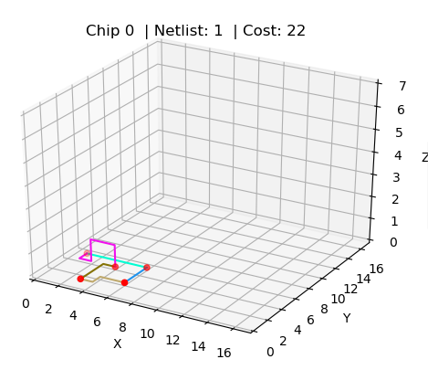

# Chips-Circuits

## Gebruik
Voor het gebruik van de applicatie, zal eerst de requirements moeten worden geïnstalleerd, aan de hand van onderstaande code.
```python

pip install -r requirements.txt

```

Zodra dit is gelukt, kan de applicatie gebruikt worden. Om bij het interface te komen, zal de volgende code in de terminal moeten worden ingevoerd:
```python

python main.py

```

Nu komt u in het menu, en kunt u een keuze maken uit een chip nummer, een netlist nummer, en het geprefereerde algoritme! Na het uitvoeren van het algoritme zal er een grafiek omhoog komen
met de kosten van de samenstelling en de manier waarop het gestructureerd is.

## Structuur
Alle python scripts staan in de map code. Data bevat alle chips met de bijbehorende netlists en doc bevat verschillende voorbeelden van uitkomsten die wij hebben verkregen. Results bevat een gedeelte van de resultaten die we hebben gevonden tijdens het gehele proces.

## Case
De case bestaat uit het vormen van een chip. De chip bestaat uit verschillende gates die op een bepaalde manier met elkaar verbonden staan. Deze manier komt voort uit de netlist.

### Voorbeeld:
##### Chip bestaat uit gates:

| chip | coordinaten |
|---|---|
| 1 | (1, 5) |
| 2 | (6, 5) |
| 3 | (4, 4) |
| 4 | (6, 2) |
| 5 | (3, 1) |

##### En de gates moeten verbonden zijn volgens de netlist:
| chip_a | chip_b |
|---|---|
| 1 | 2 |
| 1 | 3 |
| 3 | 5 |
| 4 | 2 |
| 4 | 5 |

##### Wat er vervolgens op deze manier uit komt te zien:


### Echter zijn er constricties waaraan voldaan moet worden
* Draden mogen niet overlappen
* Draden mogen niet door andere gates heenlopen
* Het kruizen van draden mag, maar kost 300

## Oplossingen
Voor deze case zijn verschillende algoritmes van toepassing. Hierbij hebben wij gekozen voor deze algoritmes:
* Random
* Greedy
* A*

## Random
Bij dit algoritme wordt bij elke stap van het leggen van een draad een willekeurige directie gepakt. Dit is een mogelijke oplossing voor de eerste chip en zijn netlists, maar zodra
er meer kabels en meer gates bijkomen, kan het random algoritme niet meer tot een oplossing komen. 

## Greedy
Bij dit algoritme wordt bij elke stap van het leggen van een draad de afstand tussen het doel en het huidige punt berekent, en zo de meest optimale directie te bepalen.
Dit zorgt ervoor dat bij kleinere chips de meest lage kosten tevoorschijn komen, en dat grotere chips en netlist wel tot een oplossing kunnen komen. Echter de meest
lastige chip en netlists kan greedy niet oplossen, omdat hij zichzelf vastloopt.

## A*
Bij dit algoritme wordt bij elke stap gekeken naar de afstand tussen het doel en het huidige punt, maar wordt elke mogelijke richting die eerder nog open stond opgeslagen, zodat 
wanneer de lijn vast komt te liggen hij altijd nog terug kan naar een eerdere directie. Dit zorgt ervoor dat de moeilijkste chips en netlist een oplossing kan krijgen. Bij dit algoritme
wordt het kruizen van kabels zo veel mogelijk voorkomen (tenzij er geen andere mogelijkheid is), om zo kosten te minimaliseren. 

## Simulated Annealing
Simulated Annealing is een methode voor het oplossen van optimisatie problemen. Hierbij staat temperatuur centraal. De temperatuur/energie begint hoog en neemt lineair af. Deze energie zorgt ervoor dat het accepteren van minder goede states ook mogelijk is. Dit zorgt ervoor dat de kans om in een lokaal optimum te blijven hangen, zoals bij bijvoorbeeld een hillclimber, minder vaak voor komt. 

